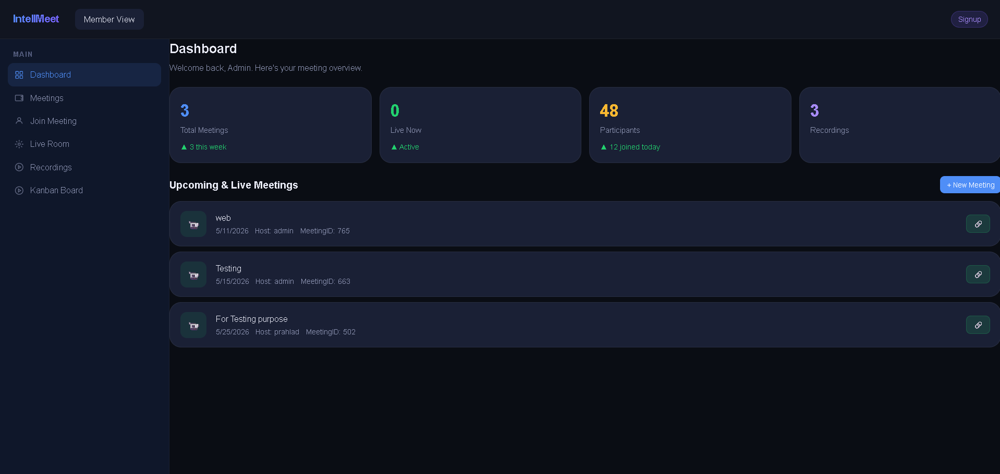
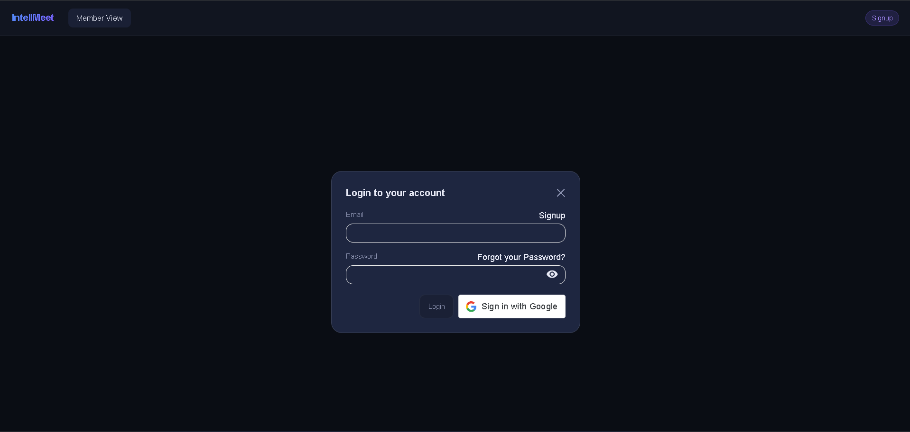
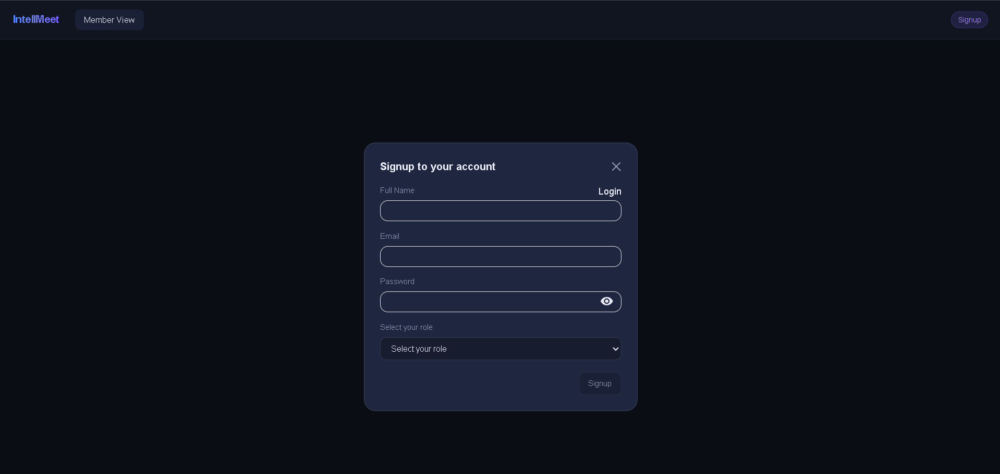

# 🤖 IntellMeet – AI-Powered Enterprise Meeting & Collaboration Platform

> Production-Grade Full-Stack MERN Application with Real-Time Video Meetings, AI Meeting Intelligence, and Team Collaboration.

<p align="center">
  </p>

---

## 📌 Project Information

**Project Title:** IntellMeet – AI-Powered Enterprise Meeting & Collaboration Platform

**Prepared For:** Zidio Development – Web Development Internship

**Domain:** Full Stack Web Development

**Project Type:** Industry-Level MERN Stack Application

**Author:** Prahlad Agarwal

---

# 🚀 Project Overview

IntellMeet is an enterprise-grade collaboration platform designed to improve productivity during remote and hybrid work environments.

Traditional meetings often result in scattered notes, missed action items, and inefficient follow-ups. IntellMeet addresses these challenges by integrating real-time communication with AI-powered meeting intelligence.

The platform transforms meetings into actionable workflows by combining:

- Real-time video conferencing
- AI-generated meeting summaries
- Action item extraction
- Meeting recordings
- Project management capabilities

---

# 🎯 Objectives

The primary objectives of this project are:

- Develop a scalable MERN stack application.
- Enable seamless video meetings.
- Improve productivity through AI-powered insights.
- Provide a centralized workspace for collaboration.
- Demonstrate full-stack development skills suitable for enterprise environments.

---

# 💼 Business Value

IntellMeet helps organizations:

✅ Reduce meeting follow-up time by 40–60%.

✅ Improve team productivity by 25–40%.

✅ Automate meeting documentation.

✅ Increase accountability using action tracking.

✅ Enable efficient remote collaboration.

---

# ✨ Key Features

| ID | Feature | Description |
|-----|-----------|-------------|
| F-01 | Authentication System | Secure signup/login using JWT |
| F-02 | Video Meetings | Real-time meetings using WebRTC |
| F-03 | AI Meeting Intelligence | Summaries and action item extraction |
| F-04 | Team Collaboration | Live chat and shared discussions |
| F-05 | Meeting Dashboard | View upcoming and past meetings |
| F-06 | Recording Support | Store and access recordings |
| F-07 | Kanban Board | Team project management |
| F-08 | Live Room | Join ongoing meetings instantly |
| F-09 | Meeting Links | Shareable meeting invitations |
| F-10 | Responsive Design | Optimized for various devices |

---

# 🛠 Tech Stack

## Frontend

- React.js
- Vite
- JavaScript
- Tailwind CSS
- React Router DOM
- Axios

## Backend

- Node.js
- Express.js

## Database

- MongoDB
- Mongoose

## Authentication

- JWT Authentication
- bcrypt.js

## Real-Time Communication

- Socket.io
- WebRTC

## AI Integration

- Groq APIs *(Planned Enhancement)*

## Deployment

- Vercel + Render

## Version Control

- Git
- GitHub

---

# 🏗 System Architecture

```
Frontend (React + Vite)
        │
        ▼
 REST APIs / Socket.io
        │
        ▼
Backend (Node.js + Express)
        │
        ▼
MongoDB Database
        │
        ▼
AI Services (Future Scope)
Groq API'S
```

---

# 📷 Application Screenshots

## 🔐 Login Page

The login interface provides secure access for existing users with password visibility control and Google authentication support.



---

## 📝 Signup Page

New users can create accounts by providing profile information and selecting their role within the platform.



---

## 📊 Dashboard

The dashboard offers an overview of meetings, participants, recordings, and quick access to collaboration tools.

Features displayed:

- Total Meetings
- Active Meetings
- Participants Count
- Recordings
- Upcoming Meetings
- Meeting Sharing Links


---

# 🔒 Security Features

The application follows modern security practices including:

- JWT-based authentication
- Password hashing using bcrypt
- Protected routes
- Input validation
- Environment variable management
- Secure API communication
- Role-based authorization

---

# ⚡ Performance & Scalability

Designed with scalability in mind:

- Low latency communication using Socket.io
- Efficient state management
- Modular architecture
- Optimized frontend rendering
- Support for concurrent meeting sessions
- Extensible microservice-ready structure

---

# 🧠 Challenges Faced

During development, several technical challenges were encountered:

### Real-Time Communication

Managing synchronization between participants during meetings.

### Authentication Flow

Implementing secure JWT workflows and protected routes.

### Dashboard Management

Handling dynamic meeting states and rendering updates efficiently.

### UI Consistency

Maintaining a professional user experience across all modules.

---

# 📚 Learning Outcomes

This internship project significantly improved my understanding of:

- Full Stack MERN Development
- REST API Design
- Authentication and Authorization
- Real-Time Systems using Socket.io
- WebRTC Fundamentals
- Database Modeling
- Component-Based Architecture
- Professional Documentation Standards
- GitHub Project Management

---

# 🚀 Future Enhancements

Planned improvements include:

- AI-powered transcription
- Action item assignment
- Calendar integration
- Email notifications
- Analytics dashboards
- Docker containerization
- CI/CD implementation

---

# 📂 Project Structure

```bash
IntellMeet/
│
├── frontend/
│   │
│   ├── api/                    # API request functions and endpoints
│   ├── components/
│   │   └── ui/                 # Reusable UI components
│   │
│   ├── context/                # React Context providers
│   ├── lib/                    # Utility/helper functions
│   ├── pages/                  # Application pages and routes
│   ├── peer/                   # WebRTC peer connection logic
│   ├── store/                  # Global state management
│   ├── styles/                 # Custom styles and theme files
│   │
│   ├── App.tsx                 # Root application component
│   ├── main.tsx                # Application entry point
│   └── index.css               # Global CSS styles
│
├── backend/
│   │
│   ├── config/                 # Database and environment configuration
│   ├── controller/             # Business logic and request handlers
│   ├── jwt/                    # JWT token generation and verification
│   ├── middleware/             # Authentication and custom middleware
│   ├── models/                 # MongoDB/Mongoose schemas
│   ├── public/                 # Public static files
│   ├── routes/                 # API route definitions
│   ├── services/               # External and internal services
│   ├── socketIO/               # Socket.io event handlers
│   │
│   └── index.js                # Backend server entry point
│
├── assets/                     # Images, icons, screenshots, static files
|   ├── login.png
│   ├── signup.png
│   └── home-page.png
|
├── README.md                   # Project documentation
```

---

# 🌐 Live Demo

**Live Website:**  
Live URL Here

Example:

```
https://intellmeet-ai-powered-video-calling.vercel.app/
```

---

# 💻 GitHub Repository

**Repository Link:**  

GitHub Repository URL

Example:

```
https://github.com/prahlad-agarwal/IntellMeet---AI-powered-video-calling-application
```


# 🏁 Conclusion

IntellMeet represents more than a meeting platform—it demonstrates the ability to design and develop a scalable, secure, and user-centric enterprise application using modern web technologies.

Through this project, I gained hands-on experience in full-stack development, real-time communication systems, authentication mechanisms, collaborative application design, and professional project documentation.

This internship project strengthened both my technical expertise and problem-solving abilities, preparing me for real-world software development challenges.

---

## 🙌 Acknowledgements

Special thanks to **Zidio Development** for providing the opportunity and project guidelines that encouraged the development of an industry-oriented solution and enhanced practical learning experiences.

---
